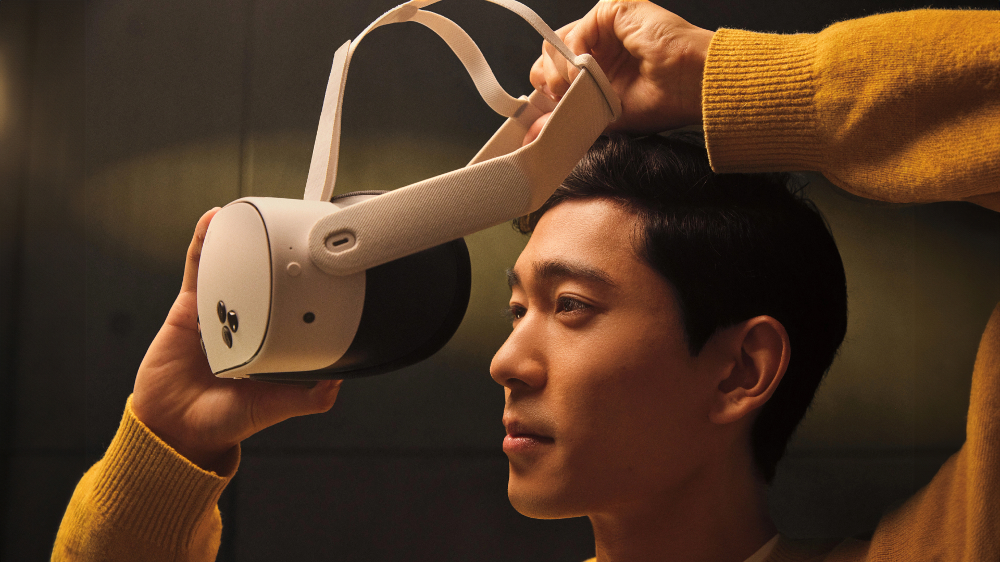
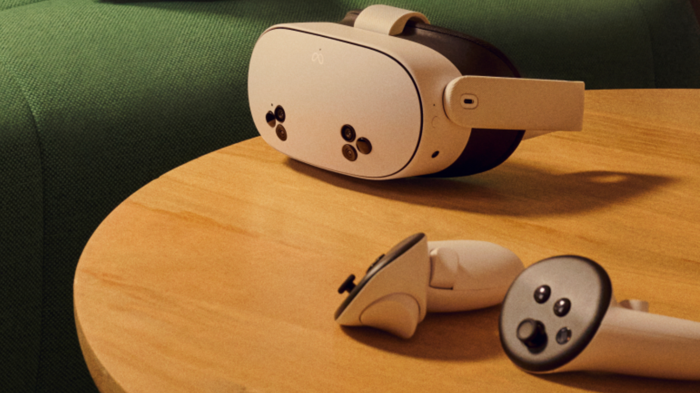

+++
title = "Meta lance le Quest 3S, un casque de VR à la fiche technique sexy vendu 330 €"
date = 2024-09-25T19:13:00+01:00
draft = false
author = "Félix"
tags = ["Actu"]
image = "https://nostick.fr/articles/2024/septembre/2509-meta-annonce-quest-3s/quest3S.png"
+++

 

Nos 5 lecteurs qui s’intéressent à la VR seront ravis d’apprendre l’arrivée prochaine [du Quest 3S](https://www.meta.com/fr/quest/quest-3s/), une version plus abordable du Quest 3 vendue 329,99 €. Le design évolue légèrement avec de nouvelles caméras permettant de voir son environnement en couleur. Les capteurs sont globalement similaires, et on y retrouve la même puce Qualcomm Snapdragon XR2 Gen2 que dans le Quest 3 ainsi que ses 8 Go de RAM. 

Au vu du prix, c’est pas mal du tout. Meta réduit la facture à l’aide de lentilles moins chères : on passe de 2 064 × 2 208 sur le Quest 3 à 1 832 × 1 920. Le champ de vision est un peu moins bon là où les lentilles pancake laissent leur place à des lentilles Fresnel plus classiques. On notera aussi que Zuck a fait l’impasse sur le capteur de profondeur. L’expérience devrait donc être moins bonne que sur un Quest 3 tout en restant largement suffisante pour la majorité des joueurs.

 

Mis à part ça, le Quest 3S n’a pas grand-chose à envier au modèle haut de gamme. Les manettes sont les mêmes et l’autonomie légèrement supérieure, grimpant jusqu’à 2 h 30. Meta glisse dans la boîte un code pour le futur *Batman: Arkham Shadow* qui sortira en octobre ainsi que 3 mois d’abonnement à son service Meta+ donnant accès à quelques titres. Deux tailles de stockage sont proposées, à savoir 128 et 256 Go. Les précommandes sont [dès maintenant](https://www.meta.com/fr/quest/quest-3s/) ouvertes pour une livraison prévue mi-octobre.

Est-ce qu’il faut en acheter un ? Si vous n’avez jamais eu de casque VR, c’est une bonne affaire : le casque devrait vous procurer plusieurs semaines de fun, encore plus si vous avez un PC capable de faire tourner des jeux VR comme *Half-Life Alyx*. Le tarif est vraiment abordable au vu du matériel embarqué. Après on ne va pas se mentir, il finira sans doute par prendre la poussière dans quelques mois, mais ça pourra être sympa de le sortir pour une partie occasionnelle ou pour faire une démo aux invités. 

 

Si vous avez déjà un casque… bof ? J’ai testé le Quest 3 à sa sortie, et bien que la technologie progresse, ce n’est pas drastiquement mieux que le précédent une fois en jeu. La partie réalité mixte est assez gadget avec peu d'apps. À voir si les quelques titres VR tirant parti de la puce XR2 Gen2 vous intéressent ou si vous avez quelques bricoles en VR dans votre wishlist Steam.