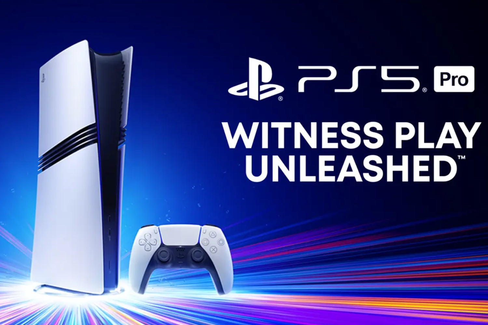

+++
title = "La PS5 Pro ajoute quelques jeux optimisés à son tableau de chasse"
date = 2024-09-25T08:07:32+01:00
draft = false
author = "Mickael"
tags = ["Actu"]
image = "https://nostick.fr/articles/vignettes/septembre/ps5-pro-unleashed.jpg"
+++

Sony s'est bien gardé de gâcher [la fête de son State of Play cette nuit](https://nostick.fr/articles/2024/septembre/2509-state-of-play-ghost-of-yotei-remasters-poignee-surprises-/) en évoquant les choses qui fâchent : les prix des consoles et accessoires du 30e anniversaire de PlayStation. Il faudra donc attendre l'ouverture des précos le 26 septembre pour en avoir le cœur, et le portefeuille, net.

Les rumeurs annoncent des prix [finalement pas si salés au moins pour le bundle PS5](https://nostick.fr/articles/2024/septembre/2309-prix-ps5-anniversaire/) avec sa manette DualSense, mais tout le monde attend évidemment de savoir à quelle sauce sera mangée le pack PS5 Pro avec ses deux manettes et leur dock de recharge… 

 

Durant sa présentation, Sony a tout de même essayé de faire contre mauvaise fortune bon cœur en [dévoilant](https://blog.playstation.com/2024/09/24/ps5-pro-developers-share-how-theyre-using-new-tech-to-enhance-their-games/) quelques nouveaux jeux qui tireront parti des capacités graphiques de la future console. 

Il y en a 20 en tout, on peut les citer ici : *Alan Wake 2, Assassin’s Creed Shadows, Demon’s Souls, Dragon Age: The Veilguard, Dragon’s Dogma II, F1 24, Final Fantasy VII Rebirth, Gran Turismo 7, Hogwarts Legacy, Horizon Forbidden West, Marvel’s Spider-Man 2, Metal Gear Solid Delta: Snake Eater, Ratchet & Clank: Rift Apart, Resident Evil 4, Resident Evil Village, Star Wars Jedi: Survivor, Stellar Blade, The Crew Motorfest, The First Descendant, The Last of Us Part II Remastered*.

Aucune véritable surprise dans le lot, à l'exception d'une poignée de titres qui sortiront dans les prochains mois (*Metal Gear*, *Dragon Age*, *Assassin's Creed Shadows*), tous sont déjà disponibles et il y a de fortes chances pour que les joueurs PS5 aient platiné la plupart d'entre eux. Tous ces titres sont censés rouler en 4K à 60 FPS (sauf Shift Up, qui se contente de promettre à 50 FPS « ou plus » pour *Stellar Blade*).

Il faudra probablement en faire bien davantage pour convaincre les sceptiques qui n'ont pas été éblouis ni par [la présentation de la PS5 Pro](https://nostick.fr/articles/2024/septembre/1009-enfin-une-ps5-pour-les-pro/), ni par le prix de la bête (800 € pour la version « standard », pas le bundle du 30e). Pourtant, [les améliorations graphiques sont bien au rendez-vous](https://nostick.fr/articles/2024/septembre/2109-backlog-xbox-ps5-pro-concord-sims-4-gta-online/#la-bonne-nouvelle-de-la-semaine--finalement-cest-pas-si-pourri-la-ps5-pro) mais Sony les vend bien mal.