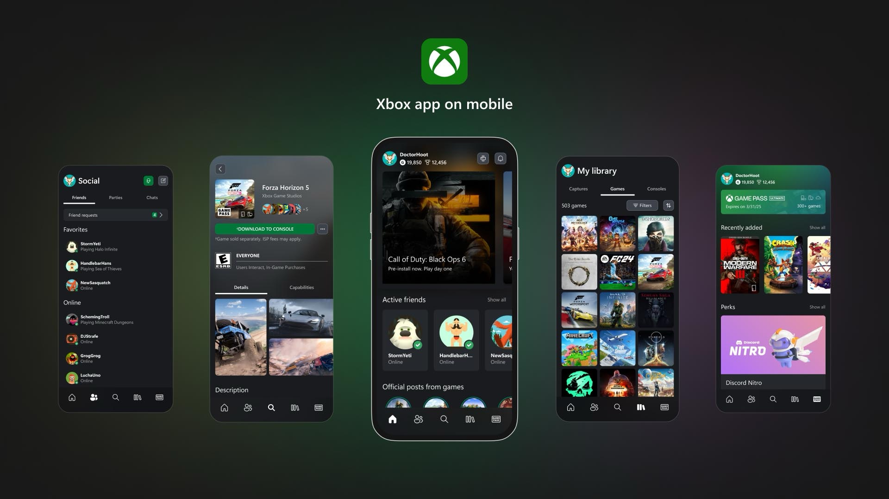
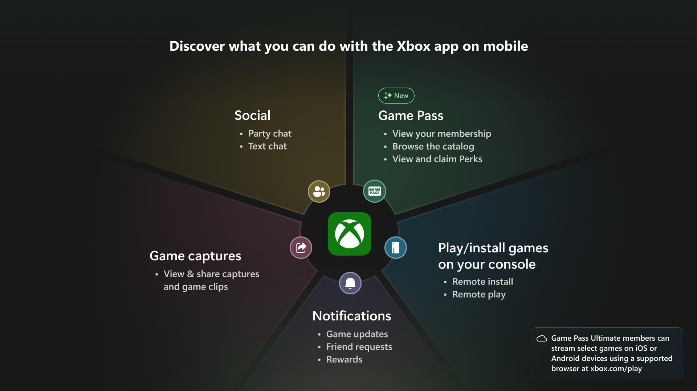

+++
title = "Les deux apps mobiles Xbox ne feront bientôt plus qu'une"
date = 2024-09-25T17:44:32+01:00
draft = false
author = "Mickael"
tags = ["Actu"]
type = "telex"
+++

Microsoft a dû se dire que deux apps mobiles pour Xbox, c'était probablement une de trop. C'est pourquoi les fonctions de l'application Xbox Game Pass vont se retrouver dans l'app Xbox ([iOS](https://apps.apple.com/us/app/xbox/id736179781), [Android](https://play.google.com/store/apps/details?id=com.microsoft.xboxone.smartglass&hl=fr_CA&pli=1)) : consultation du catalogue de jeux du service, notification lors de l'arrivée de nouveautés, et aussi profiter des promos du Game Pass Ultimate.

Ce [rapprochement](https://news.xbox.com/en-us/2024/09/25/xbox-update-september-game-bar-compact-mode/) va s'opérer dans les prochains jours pour les utilisateurs inscrits au programme de bêta Xbox, avant que la mise à jour soit proposée à tout le monde. L'app Xbox Game Pass ne sera plus disponible au téléchargement en novembre. Ça ne changera rien au Xbox Cloud Gaming : pour jouer aux jeux en streaming (un service offert dans la formule Ultimate), il faudra toujours en passer par un navigateur web depuis un smartphone.