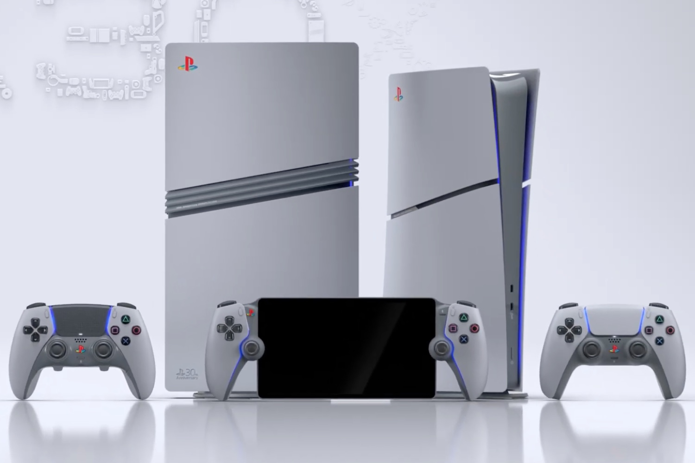

+++
title = "Le bundle PS5 Pro du 30e anniversaire est en vente pour 1 100 €"
date = 2024-09-26T08:30:32+01:00
draft = false
author = "Mickael"
tags = ["Actu"]
type = "une"
image = "https://nostick.fr/articles/2024/septembre/2609-bundle-ps5-pro-en-vente/ps5-30e-anniversaire-collection.jpg"
+++

C'est le grand jour pour les fans de PlayStation qui veulent enflammer leur carte bleue et détruire toute la confiance que leurs banquiers portaient en eux. Sony a finalement lancé les précommandes non seulement de la PS5 Pro, mais aussi de [la collection du 30e anniversaire de PlayStation](https://nostick.fr/articles/2024/septembre/1909-ps5-30e-anniversaire/) ! Rendez-vous tout de suite sur la [boutique officielle](https://direct.playstation.com/fr-fr) et croisez les doigts, vous n'êtes pas le seul sur les rangs.

Si une PS5 Pro commandée aujourd'hui (799 € sans lecteur optique) sera livrée à partir du 7 novembre. Pour ce qui concerne les différents bundles et accessoires de la collection anniversaire, ils seront livrés à partir du 21 novembre.

 

Évidemment, c'est la collection anniversaire qui est attendue au tournant, et surtout… les prix. Sony n'a pas eu d'autre choix que de les révéler, alors les voici :

- **1 100 €** pour le bundle PS5 Pro 30e anniversaire qui contient : une PS5 Pro donc, une manette DualSense, une manette DualSense Edge, un dock de recharge, un socle vertical, une façade pour le lecteur optique (pas fourni), plus des tas d'accessoires plus ou moins rigolos ;
- **500 €** pour le bundle PS5 Slim 30e anniversaire qui contient : une PS5 mais oui, une manette DualSense, un socle vertical, une façade pour le lecteur optique (pas fourni), plus le lot d'accessoires aux couleurs de PlayStation ;
- **250 €** : DualSense Edge ;
- **80 €** : DualSense ;
- **240 €** : PS Portal.

Tous ces articles sont en édition limitée, mais Sony a jugé malin de ne produire que 12 300 unités (pour 03/12, la date anniversaire du lancement de la première PlayStation) du bundle PS5 Pro. Il est déjà en rupture de stock, tout comme le bundle PS5 Slim.
