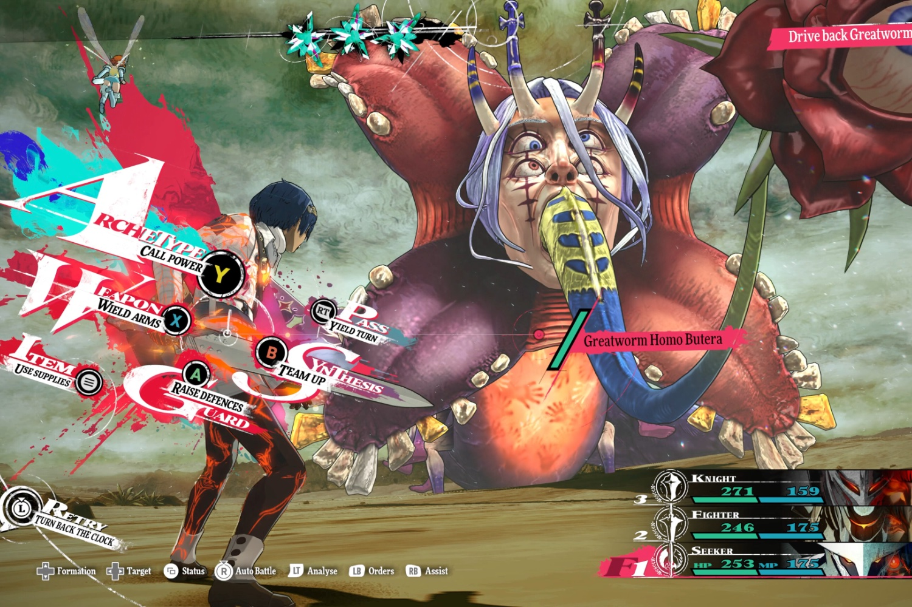

+++
title = "Metaphor: ReFantazio, une démo avant de se lancer dans le grand bain"
date = 2024-09-26T08:01:32+01:00
draft = false
author = "Mickael"
tags = ["Actu"]
image = "https://nostick.fr/articles/vignettes/septembre/Metaphor-ReFantazio.jpg"
+++

En attendant *Persona 6* qui finira bien par arriver un jour prochain, pourquoi ne pas jeter un œil ou deux sur *Metaphor: ReFantazio* ? Atlus, qui gère la saga *Persona*, a manifestement pensé qu'il était temps, entre deux opus/remakes/spin-of, de se lancer dans une nouvelle saga ! Et pas n'importe laquelle : *Metaphor* est développé par le studio Zero, fondé par nul autre que Katsura Hashino, directeur historique de *Shin Megami Tensei* et de plusieurs volets de *Persona*.

 

Bref, il y a beaucoup de points en commun entre les deux jeux. Les amateurs pourront s'en rendre compte dès à présent, grâce à la démo dispo sur [Steam](https://store.steampowered.com/app/3130330/Metaphor_ReFantazio__Dmo_du_prologue/), le [PS Store](https://store.playstation.com/en-us/product/UP0177-PPSA25425_00-METAPHORNATRIAL1) et chez [Xbox](https://www.xbox.com/en-US/games/store/metaphor-refantazio/9nwnddxtzh6d) ! Il s'agit du prologue dans lequel on découvrira le début du jeu, et oui. Au menu : quatre donjons tout de même, 7 classes à découvrir sur les 40 que compte le titre, et 6 alliés.

La progression dans la démo sera conservée dans le jeu au complet, et vu qu'on est encore parti sur une bonne centaine d'heures, c'est pas mal de prendre un peu d'avance. L'interface et le système de jeu rappellent évidemment *Persona*, les combats sont au tour par tour avec des phases en temps réel. *Metaphor: ReFantazio* sera dispo le 11 octobre.