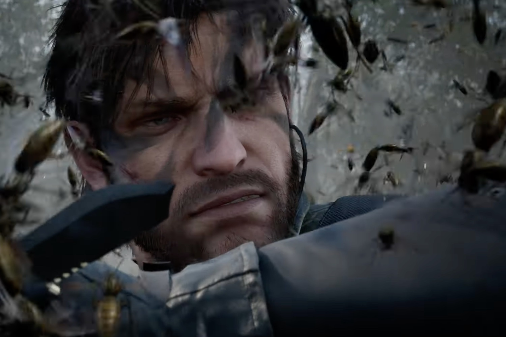

+++
title = "Xbox se paye enfin la collection Final Fantasy Pixel Remaster"
date = 2024-09-26T18:47:32+01:00
draft = false
author = "Mickael"
tags = ["Actu"]
image = "https://nostick.fr/articles/vignettes/nostick.jpg"
+++

Dans une semaine largement dominée par l'actu PlayStation, Xbox a tout de même voulu faire entendre sa petite musique, à l'occasion du Tokyo Game Show. Il n'y a pas eu d'énormes annonces, à l'exception de l'arrivée en force de nouveaux jeux Square Enix sur Xbox ! Enfin, quand on dit « nouveaux », il faut relativiser : il s'agit de la collection *Final Fantasy Pixel Remaster*, qui contient les six premiers volets de la saga avec des gros pixels.



On est ravi pour la team green, néanmoins, cette compile était sortie il y a deux ans sur PC, PS4 et Switch. Allez, ne nous plaignons pas et saluons aussi le débarquement de *Legends of Mana* et de *Trials of Mana* sur le Game Pass et ce, dès aujourd'hui.

En plus de ces deux jeux Squeenix, le Game Pass s'enrichit de *We Love Katamari Reroll+ Royal Reverie* et *All You Need Is Help*, là aussi avec une dispo ce jeudi. Le 5 novembre, les vieux de la vieille abonnés au Game Pass prendront quelques jours de congé pour s'offrir une petite virée dans *StarCraft: Remastered* et *StarCraft II: Campaign Collection* !



Parmi les grosses annonces du jour, retenons également la bêta Xbox le 10 octobre pour *[FragPunk](https://www.youtube.com/watch?v=Kg7JmrNsodQ)*, un shooter 5 vs 5 qui n'a pas l'air très très original, ce coup d'œil sur la démo de *[Dragon Quest III HD-2D](https://www.youtube.com/watch?v=rOy0RsMDRs8)*, ou encore un aperçu de 5 mn sur *[Atelier Yuma](https://www.youtube.com/watch?v=jNaLtNsN7oM)*.



Xbox a même eu droit à une nouvelle bande annonce pour *Metal Gear Delta: Snake Eater* qui donne toujours autant envie.