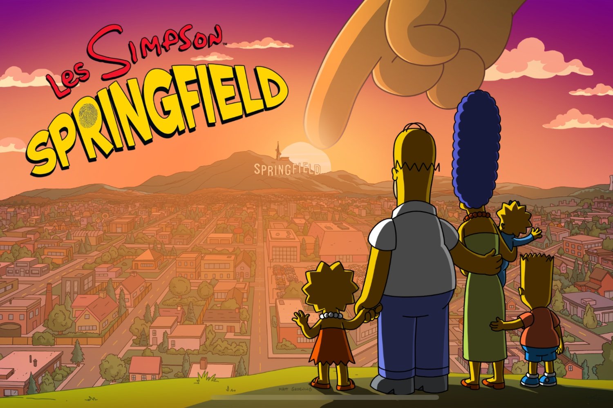

+++
title = "Après 12 ans de bons et loyaux services, The Simpsons: Tapped Out va s'arrêter"
date = 2024-09-27T08:55:32+01:00
draft = false
author = "Mickael"
tags = ["Actu"]
image = "https://nostick.fr/articles/vignettes/septembre/simpsons.jpg"
+++

C'est la fin d'une époque pour des millions de joueurs qui se sont frottés à *The Simpsons: Tapped Out* sur leur smartphone à un moment de leur vie. Electronic Arts a en effet annoncé que les serveurs allaient être débranchés le 24 janvier prochain ! Un crève-cœur, le jeu mobile étant disponible depuis 2012 sur iOS, et l'année suivante sur Android.

Le jeu est toujours disponible gratuitement au téléchargement dans les boutiques respectives d'Apple et de Google et ce, jusqu'au 31 octobre. Il restera jouable jusqu'à la date fatidique. En revanche, les achats intégrés ont d'ores et déjà été désactivés. Cette décision de mettre fin à une aventure de 12 ans est pleine d'émotions, [raconte](https://www.facebook.com/TheSimpsonsTappedOut/posts/pfbid0AKUbrM6T3N9zczdpSoHBSVwEoDbUGSuFJiAwmxEynuqvjwNdoJZn2zo7Ls1s6rk4l) EA sur Facebook (?).

Durant toutes ces années, l'éditeur a livré 308 mises à jour, introduit 831 personnages et créé 1 463 quêtes et missions en tout genre. EA ne donne aucune raison pour laquelle le jeu ferme ses portes, alors qu'il dispose d'une communauté de fans toujours très importante et prête à dépenser sans compter pour construire la Springfield de leurs rêves (c'est le but du jeu).  Deux ans après son lancement, le titre avait cumulé 130 millions de dollars de revenus.

Si on voulait spéculer, on pourrait se demander si Disney ne veut pas reprendre la main sur la carrière vidéoludique des Simpsons. Après la fin programmée de *Tapped Out*, il n'existera plus de jeux basés sur la famille de dégénérés et leurs amis. Un moment idéal pour relancer la franchise… et pourquoi un remake/remaster de *Hit & Run*, qui reste pour beaucoup le meilleur jeu Simpsons.