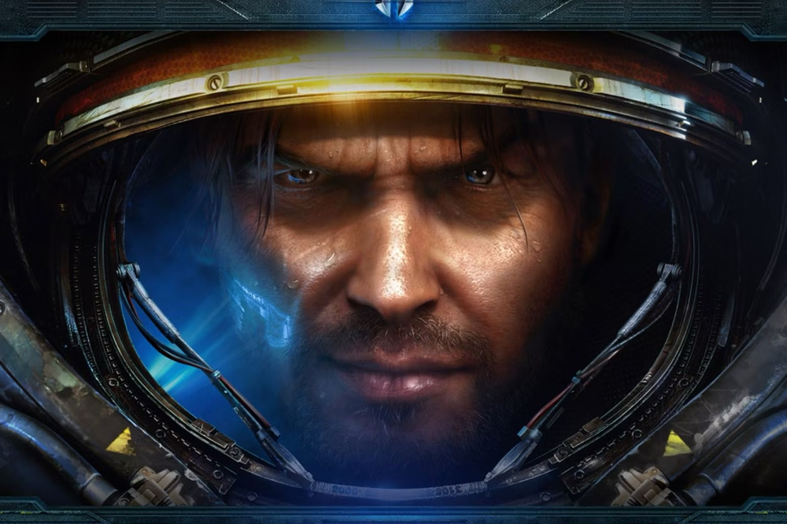

+++
title = "Blizzard développe un nouveau shooter basé sur StarCraft"
date = 2024-09-27T15:47:32+01:00
draft = false
author = "Mickael"
tags = ["Actu"]
image = "https://nostick.fr/articles/vignettes/septembre/starcraft.jpg"
+++

Allons bon, Blizzard travaille sur un shooter basé sur *StarCraft*… oui, encore ! En tournée promo pour son nouveau bouquin consacré aux coulisses du studio, Jason Schreier a [révélé](https://www.ign.com/videos/crazy-blizzard-stories-with-jason-schreier-unlocked-661) l'existence de ce titre inédit,Dan Hay, l'ancien directeur créatif de *Far Cry*, est aux manettes. Il a aussi été impliqué dans le développement d'*Odyssey*, [le survival que Blizzard a annulé](https://nostick.fr/articles/2024/septembre/0909-images-odyssey-survival-blizzard/) en début d'année.

Si la perspective d'un jeu de tir dans l'univers de *StarCraft* a de quoi intriguer, et même d'enthousiasmer pourquoi pas, le prudence recommande de garder la tête froide. Ce n'est pas la première fois que Blizzard tente sa chance dans ce domaine. *[StarCraft: Ghost](https://en.wikipedia.org/wiki/StarCraft:_Ghost)*, annoncé en 2002 et qui devait sortir sur PS2, Xbox et GameCube, a passé de nombreuses années en gestation avant d'être « suspendu » en 2006. Une build avait fuité en 2020, via un dev kit de la Xbox :

 

Pas découragé, Blizzard avait relancé un projet similaire avec *Ares*, mais le développement a été arrêté en 2019. La nouvelle tentative sera-t-elle la bonne ? Croisons les doigts… Les fans de *StarCraft* pourront retrouver leur passion débordante à partir du 5 novembre : la version Remastered et *StarCraft II* débarqueront en effet sur le Game Pass.