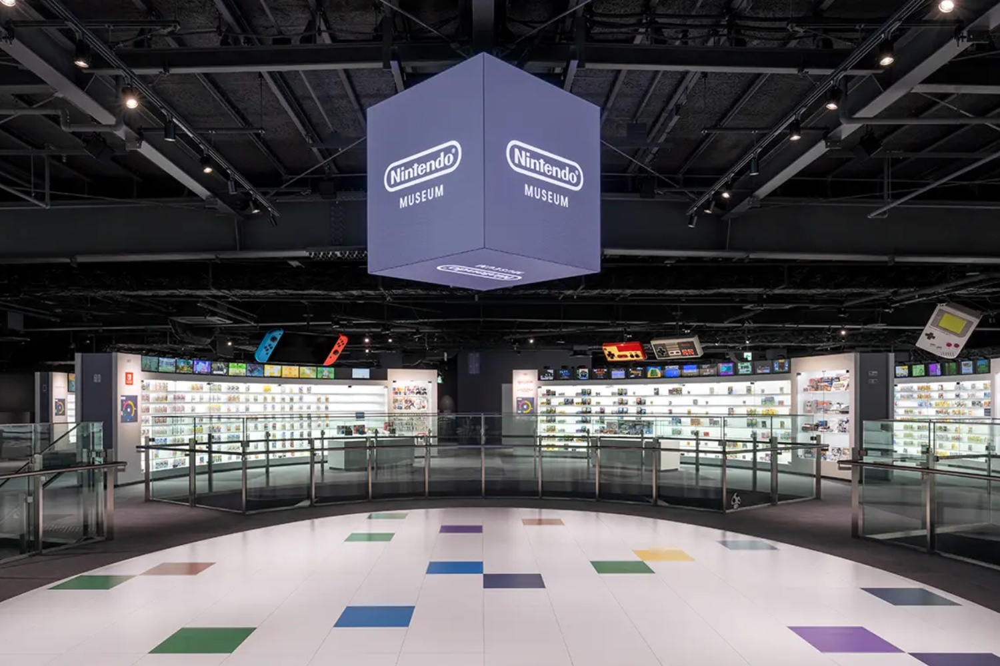

+++
title = "IA générative, course à la puissance : Nintendo trace sa propre voie"
date = 2024-09-27T09:15:32+01:00
draft = false
author = "Mickael"
tags = ["Actu"]
image = "https://nostick.fr/articles/vignettes/septembre/super-mario.jpg"
+++

")

On ne sait pas grand chose de la Switch 2, mais il y a au moins une chose d'à peu certain : la future console n'ira pas chercher la concurrence sur le terrain de la puissance. Nintendo a lâché l'affaire depuis longtemps, préférant se concentrer sur le gameplay et le plaisir de jouer… avec une certaine réussite !

Et la Switch 2, ou peu importe son nom, perpétuera certainement cette stratégie. Shigeru Miyamoto, en tournée promo à l'occasion de l'ouverture prochaine du musée Nintendo de Kyoto, l'a encore confirmé chez *[Famitsu](https://www.famitsu.com/article/202409/18892)* : « *J'espère [que les employés et les gens qui connaissent Nintendo] comprendront Nintendo qui ne veut pas s'impliquer dans ce que l'on appelle parfois la "guerre des consoles"* », en référence aux fiches techniques toujours plus impressionnantes.

Cette guerre des consoles est loin d'être terminée, évidemment : Sony vient de [lancer les précos de la PS5 Pro](https://nostick.fr/articles/2024/septembre/2609-bundle-ps5-pro-en-vente/)… Tout ça, c'est très loin de Nintendo, qui « *continuera à créer des produits qui sont spécifiquement Nintendo en utilisant les différentes technologies disponibles aujourd'hui* », ajoute Miyamoto. « *Et nous continuerons à créer non seulement des jeux, mais aussi des contenus de divertissement* », précise-t-il en pensant aux films et à tout ce que fait l'entreprise à côté pour fructifier ses franchises comme les parcs d'attraction, et ce fameux musée.

Cette façon de faire de Nintendo s'incarne aussi dans l'utilisation des technologies. Le buzzword du moment, c'est évidemment l'IA générative. Shuntaro Furukawa, le président de Nintendo, a [déjà dit ce qu'il pensait du sujet](https://nostick.fr/articles/2024/juillet/0407-nintendo-ia-generative-developpement-jeux/), et pas que du bien surtout en termes de respect de la propriété intellectuelle. 

Shigeru Miyamoto lui emboîte le pas dans le *[New York Times](https://www.nytimes.com/2024/09/25/arts/design/shigeru-miyamoto-interview-nintendo-museum.html)* cette fois, en décrivant le mode de fonctionnement de l'entreprise. « *On peut donner l'impression que nous allons dans la direction opposée [de celle de l'industrie] pour le plaisir d'aller à contre-courant, mais nous voulons vraiment trouver ce qui rend Nintendo spécial* », déclare-t-il.

Concernant plus spécifiquement l'IA générative et le buzz assourdissant autour, « *tout le monde commence à aller dans la même direction, mais c'est là que Nintendo préfère prendre une direction différente* ». Ça ressemble presque à un mantra !