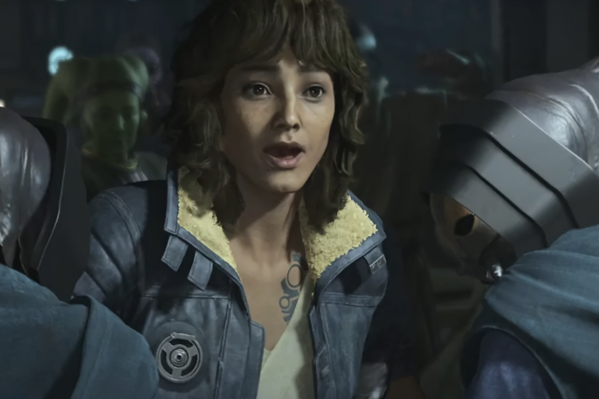
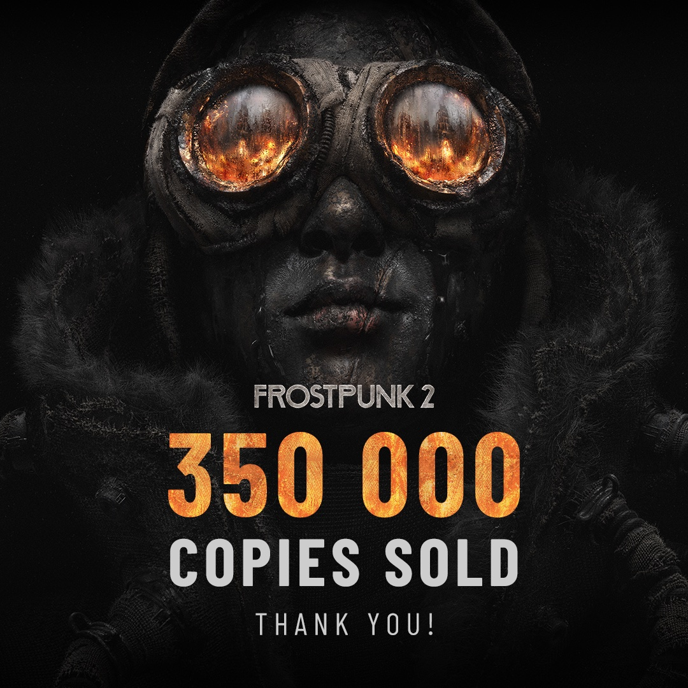

+++
title = "On vide le backlog de la semaine : Assassin's Creed Shadows, Frostpunk 2, musée Nintendo, TCG Card Shop Simulator…"
date = 2024-09-28T06:30:01+01:00
draft = false
author = "Mickael"
tags = ["XXL"]
image = "https://nostick.fr/articles/vignettes/septembre/star-wars-outlaws-2.jpg"
+++

L’actualité du jeu vidéo ne s’arrête pas à la poignée d’articles publiés sur *Nostick* ! Histoire de rattraper le retard accumulé, voici un retour rapide sur quelques unes des infos les plus importantes (ou insignifiantes) de la semaine.

## Les images de la semaine : vite, au musée Nintendo pour acheter des trucs idiots !

Ça va être compliqué de ne pas se précipiter au musée Nintendo qui ouvre très bientôt à Kyoto (le 2 octobre). Non seulement on pourra y admirer les reliques tirées de la très riche histoire de l'entreprise, qui a tout récemment fêté ses 135 ans, mais surtout, surtout, il y a une boutique avec des tas de trucs exclusifs !

Nintendo n'a pas lésiné sur le merchandising, comme ont pu le constater les heureux premiers visiteurs (des journalistes invités pour visiter le musée). En dehors des t-shirts, on trouve aussi des tuyaux Super Mario, des tasses Super NES, de très excitants porte-clefs avec des reproductions de manettes (dont celle du Virtual Boy), des coussins en forme de télécommande Wii et de manettes Famicom… *Game Watch* a claqué des tas de photos [à admirer ici](https://game.watch.impress.co.jp/docs/preview/1625869.html).



Et pour dépenser sans compter, il faudra vraiment se rendre sur place, car Nintendo n'a aucune intention de créer une franchise avec des musées un peu partout dans le monde. « *Ce projet [de musée] n'a pas été créé à des fins commerciales, mais plutôt pour aider les employés de Nintendo à mieux comprendre l'entreprise, et pour permettre au grand public d'en apprendre davantage sur Nintendo* », a expliqué Shigeru Miyamoto à *Game Watch*. « *Nous n'avons donc aucune intention de l'étendre à d'autres endroits* ». 

Et pour ceux qui n'ont pas le budget pour un tel voyage (ni pour acheter des idioties pareilles), le même Miyamoto a offert cet été une petite visite guidée des lieux en vidéo :

 

## Les chiffres de la semaine

**350 000**, comme le nombre de copies vendues pour *Frostpunk 2*. Quatre jours après son lancement, la simulation de villes post-apo de 11bit Studios a [atteint](https://x.com/frostpunkgame/status/1838181485859246232) cette marque, ce qui lui permet de couvrir les coûts de production du jeu et du marketing. 

Une excellente nouvelle pour cette suite qui était très attendue, et qui a fini par dépasser son prédécesseur en nombre de joueurs en simultané sur Steam avec un pic à [35 500](https://steamdb.info/app/1601580/charts/). L'équipe s'emploie à corriger les petits bugs avant de se lancer dans un (probable) 3e épisode, parce qu'il est temps.

**1 million**, comme le nombre de copies vendues pour *Unicorn Overlord*, le RPG tactique édité par Atlus. Il a fallu 7 mois pour parvenir au [chiffre magique](https://x.com/Atlus_West/status/1838385009322758274), sachant que les jeux développés par Vanillaware ne sont pas disponibles sur PC (*Unicorn Overlord* est sorti sur Switch, Xbox et PlayStation). 

**3 millions**, comme le nombre de copies vendues pour *GRIS*. Le jeu contemplatif de Nomada sorti en 2018 est une des grandes réussites indés de ces dernières années. Il a le bon goût [d'atteindre](https://x.com/nomadastudiobcn/status/1838963894712221984) ce seuil quelques semaines avant le lancement du prochain titre du studio, *NEVA* (le 15 octobre).

Dans les trois cas, il s'agit de jeux exigeants qui exigent des joueurs un certain engagement. Il y a donc de l'espoir pour les jeux pas faciles !

## Les petits rigolos de la semaine : la nouvelle escroquerie de Fntastic 

Fntastic est de retour pour voler votre argent ! Le studio cherche à se réinventer après l'escroquerie *The Day Before*, un MMO en monde ouvert à base de zombies sorti fin 2023 après de nombreux reports, et retiré des rayons quelques jours plus tard. Et pour cause, le jeu n'avait absolument rien à voir avec les promesses faites lors de son annonce en 2021, qui l'avaient propulsé en tête des wishlists sur Steam.

Non content d'avoir exploité des volontaires sans les payer, Fntastic a pondu [un jeu extrêmement médiocre](https://www.youtube.com/watch?v=83YEozXj_7Y) réalisé de bric et de broc. Mais puisque la honte est morte, le studio revient du diable vauvert en tendant la sébile aux joueurs. Parce que « *tout le monde mérite une seconde chance* », [affirme-t-il](https://x.com/FntasticHQ/status/1839423294422024688) sur les réseaux sociaux !

« *Nous nous excusons pour The Day Before, et nous prenons la responsabilité de ce qui est arrivé* », poursuit l'entreprise (qui d'autre pourrait prendre cette responsabilité ?) qui lance un projet Kicksarter pour arnaquer les gogos. Je ne vais pas mettre le lien vers la page de financement parce que bon, faut peut-être pas exagérer. Mais il s'agit de donner de l'argent pour *Escape Factory*, un escape game multijoueur qui ne sortira probablement jamais.

 

Un engagement de 12 000 $ (!) offrira aux chanceux qui aiment jeter leurs sous par la fenêtre un « dîner inoubliable » avec les fondateurs de Fntastic. Ça pourrait être drôle.

## La grosse info de la semaine : comment ça va mal, Ubisoft ?

En annonçant cette semaine [le report d'*Assassin's Creed Shadows* à février prochain](https://nostick.fr/articles/2024/septembre/2509-assassins-creed-shadow-14-fevrir-aussi-sur-steam/), Ubisoft acte aussi la grave crise qui secoue l'éditeur depuis des mois, si ce n'est des années. De l'aveu même de l'entreprise, le report de ce qui devait être le blockbuster de la fin de l'année a été décidé en réponse aux ventes faiblardes de *Star Wars Outlaws*.

Ubisoft confirme ainsi, sans donner de chiffre toutefois, ce que les rumeurs disaient depuis le lancement du jeu *Star Wars* : c'est la déception, malgré une réception critique et publique somme toute très correcte. Le titre s'appuie pourtant sur une énorme franchise qui, dans ses déclinaisons vidéoludiques, a souvent connu de gros succès — comme l'ont démontré *Jedi Survivor* ou *[Star Wars Pinball: Solo](https://www.starwars.com/games-apps/star-wars-pinball-solo-a-star-wars-story)* (ok je rigole).

 

Le jeu d'Ubisoft paie un lancement buggué et un gameplay sans doute pas assez fouillé, notamment dans les phases d'infiltration et les séquences de shoot. Ces enseignements, et tout particulièrement les bugs, ont poussé l'éditeur à reporter *Shadows* : « *Bien que le jeu soit complet en termes de fonctionnalités, les leçons tirées de la sortie de Star Wars Outlaws nous ont conduits à accorder un temps supplémentaire pour peaufiner davantage le titre* », explique le groupe.

Franchement, personne n'en voudra à Ubisoft de prendre son temps pour offrir la meilleure expérience possible. Et comme une réponse aux débilos racistes de Twitter, le studio tiendra la promesse d'une aventure « *avec deux protagonistes, Naoe et Yasuke* ». Seul hic : ce nouveau volet d'*Assassin's Creed* va faire face à forte partie l'année prochaine, puisque *Ghost of Yotei*, la suite de *Ghost of Tsushima*, [sortira aussi en 2025](https://nostick.fr/articles/2024/septembre/2509-state-of-play-ghost-of-yotei-remasters-poignee-surprises-/). Deux jeux qui se déroulent dans le Japon féodal, et qui inviteront naturellement à des comparaisons possiblement brutales.

Il y a quelque chose de rassurant dans cette histoire : la volonté affirmée d'Yves Guillemot, le cofondateur et patron d'Ubisoft, de mettre le joueur au centre de tout. D'où la chasse aux bugs et l'abandon de l'exclusivité de six mois accordée à l'Epic Games Store, en plus de la propre boutique d'Ubisoft que personne n'utilise. *Shadows* sortira donc aussi sur Steam simultanément, tandis qu'*Outlaws* y fera son apparition dès le 21 novembre. Avec l'espoir que cette sortie, dans une version enrichie par les correctifs et les améliorations promis, dynamisent les ventes juste avant les fêtes.

« *Dans le marché ultra-concurrentiel d'aujourd'hui, les joueurs s'attendent à des expériences extraordinaires et à des jeux parfaitement aboutis dès le premier jour* », [écrit](https://insider-gaming.com/yves-guillemots-internal-memo-to-staff/?utm_source=substack&utm_medium=email) Yves Guillemot dans un mémo interne. « *Nous devons continuer à nous améliorer pour [peaufiner nos jeux] et livrer un gameplay exceptionnel. C'est cela qui permettra à Ubisoft de créer à nouveau les meilleurs jeux de l'industrie.* »

Le modèle du Season Pass va être abandonné sur les prochains jeux, à commencer par *Shadows*. Tous les joueurs auront accès au même contenu au premier jour, et ceux qui ont préco recevront la première extension gratuitement. Le Season Pass du titre contenait une quête supplémentaire et des cosmétiques, ainsi que l'accès à deux extensions.

.")

Ce qui est moins réjouissant, c'est que le boss veut concentrer les ressources de l'entreprise sur ses deux « piliers » : les jeux en monde ouvert et les jeux service. Ça ne laisse guère de place aux expérimentations type *Prince of Persia: The Lost Crown* ou *Assassin's Creed Mirage*.

Au-delà des jeux, Ubisoft pourrait bien être à la veille de changements plus profonds. Le comité exécutif de l'entreprise va en effet procéder à un examen pour améliorer le fonctionnement de la boîte, satisfaire les joueurs et « *accélérer notre trajectoire stratégique vers un modèle plus performant au bénéfice de nos parties prenantes et actionnaires* ». Ça commence comme ça, et ça finit par des charrettes de licenciements…

La chute vertigineuse de l'action (-65 % sur les douze derniers mois !) pousse en effet certains investisseurs à prendre le taureau par les cornes. Une sortie pure et simple de la Bourse, voire une vente du groupe n'est plus impossible. Actuellement, le capital est détenu à 15 % par la famille Guillemot, et 10 % par le géant chinois Tencent.

La direction d'Ubisoft a donc terriblement besoin d'un hit pour éviter une aventure qui pourrait être fatale…

## On n'a pas eu le temps cette semaine, mais on pense à eux

 

TCG Card Shop Simulator est le carton surprise du moment sur Steam, et on comprend aisément pourquoi : c'est un simulateur de boutique qui vend des cartes ~~Pokémon~~ de bestioles fantastiques ! Le jeu d'OPNeon Games n'a l'air de rien, mais gare à l'addiction. Il est dispo en [accès anticipé](https://store.steampowered.com/app/3070070/TCG_Card_Shop_Simulator/) depuis le 15 septembre pour une quinzaine d'euros, il y a aussi un [prologue gratuit](https://store.steampowered.com/app/3103840/TCG_Card_Shop_Simulator_Prologue/).



Meta a mis toutes ses chances de son côté pour vendre son nouveau casque Meta 3S : non seulement il n'est pas si cher (330 €), mais surtout il est fourni avec le jeu *Batman: Arkham Shadow*, dont on connait maintenant la date de sortie : le 2 octobre. Le titre VR développé par le studio Camouflaj (racheté par Meta) se déroule dans le même univers de l'Arkhamverse.



*Slitterhead*, le jeu d'action du studio Bokeh Game, s'annonce sous les meilleurs auspices avec son système de possession démoniaque et son univers qui nous replonge dans le Japon des années 90. Dévoilé fin 2021, il sortira finalement sur toutes les plateformes le 8 novembre.

## osef

Pour une raison qui nous échappe, le joueur de foot Cristiano Ronaldo sera [présent](https://x.com/Cristiano/status/1837556864315187418), d'une manière ou d'une autre, dans *Fatal Fury: City of Wolves* (sortie prévue le 24 avril prochain).

## Dans le reste de l'actu déchaînée

- Et si la magie noire de Valve qui permet de jouer aux gros jeux PC sur le Steam Deck s'adaptait aux smartphones ? [C'est la rumeur qui court…](https://nostick.fr/articles/2024/septembre/2309-jeux-steam-jouables-smartphones-mac/)
- *God of War Ragnarök* est dispo sur PC, via Steam, depuis la semaine dernière. Et on ne peut pas dire que le jeu PlayStation ait suscité un enthousiasme débordant. [Mais pourquoi ?](https://nostick.fr/articles/2024/septembre/2309-god-of-war-ragnarok-pc-moyen-lancement/)
- À quelle sauce la Switch 2 va-t-elle nous manger ? Qui le sait. En tout cas, ça n'empêche pas de spéculer sur [cet étrange et mystérieux nouveau produit…](https://nostick.fr/articles/2024/septembre/2309-nintendo-appareil-mystere-switch-2/)
- Delta est déjà le meilleur émulateur de consoles Nintendo sur iPhone et iPad. L'app va encore s'améliorer, mais oui, avec le support du multijoueur pour les jeux DS ! [Mais comment fait-il ?](https://nostick.fr/articles/2024/septembre/2409-delta-emulateur-multijoueur-en-ligne-jeux-ds/)
- Zelda: Echoes of Wisdom aurait pu être un jeu très différent. À l'origine, Nintendo et le studio Grezzo planchaient sur un « Zelda Maker » ! [Plus d'infos dans cette actu.](https://nostick.fr/articles/2024/septembre/2409-echoes-of-wisdom-commence-par-zelda-maker/)
- Il n'y a pas qu'Ubisoft qui ait du mal en ce moment. Le studio Don't Nod a lui aussi quelques petits soucis avec ses jeux dont les ventes n'ont pas été au rendez-vous. [Ça craint.](https://nostick.fr/articles/2024/septembre/2409-pas-la-fete-chez-dont-nod/)
- Grosse semaine pour Sony qui à l'occasion d'un State of Play a dévoilé un ou deux nouveaux jeux et pas mal de vieilleries remises au goût du jour pour la PS5. Heureusement, *Ghost of Yotei* a relevé le niveau ! [On fait le récap' dans cette actu](https://nostick.fr/articles/2024/septembre/2509-state-of-play-ghost-of-yotei-remasters-poignee-surprises-/).
- Sony a aussi lancé les précos pour la PS5 Pro, qui compte maintenant 20 jeux optimisés ! OK, c'est pas le Pérou mais il faut bien commencer quelque part. [Découvrons-les par ici](https://nostick.fr/articles/2024/septembre/2509-ps5-pro-nouveaux-jeux/).
- Vu que Nintendo n'est pas pressé de dévoiler la Switch 2, pourquoi ne pas bricoler une Switch Lite avec un écran OLED ? [Allez, c'est parti](https://nostick.fr/articles/2024/septembre/2509-switch-lite-oled-ecran-remplacement/).
- Meta veut décidément nous faire porter un casque VR. Le tout nouveau Quest 3S a pour lui une fiche technique pas vilaine, et surtout un tarif avenant. [Jetons-y un œil ici](https://nostick.fr/articles/2024/septembre/2509-meta-annonce-quest-3s/).
- En attendant la sortie de *Metaphor: ReFantazio* (et la centaine d'heures qui vont suivre pour en faire le tour), voici déjà une démo ! [Plus d'infos par là](https://nostick.fr/articles/2024/septembre/2609-metaphor-refantazio-demo/).
- Ayé ! Sony a fini par cracher sa Valda en dévoilant les prix des packs PS5 du 30e anniversaire. Bonne surprise : ce n'est pas si cher. Mauvaise surprise : les stocks sont vides. [À lire dans cette actu](https://nostick.fr/articles/2024/septembre/2609-bundle-ps5-pro-en-vente/).
- Tout vient à point à qui sait attendre : Xbox a enfin droit à la collec' *Final Fantasy Pixel Remaster*. Et à d'autres jeux aussi, comme on l'a vu pendant la présentation au TGS. [C'est à retrouver ici](https://nostick.fr/articles/2024/septembre/2609-xbox-final-fantasy-pixel-remaster/).
- C'est bientôt terminé pour un des plus gros freemium sur mobiles : *The Simpsons Tapped Out* va en effet mettre la clé sous la porte. [Par ici la veillée funèbre](https://nostick.fr/articles/2024/septembre/2709-the-simpsons-tapped-out-arret-mobile/).
- Nintendo ne fait jamais rien comme tout le monde, et c'est aussi pour ça que le constructeur connait un tel succès, comme l'a rappelé Shigeru Miyamoto cette semaine. [C'est à lire dans cette actu](https://nostick.fr/articles/2024/septembre/2709-nintendo-voie-ia-generative-course-puissance/).
- La troisième tentative sera-t-elle la bonne ? Blizzard s'est de nouveau lancé dans un projet de shooter basé sur StarCraft. Le développement ira-t-il jusqu'au bout ? [Posons-nous la question ici](https://nostick.fr/articles/2024/septembre/2709-blizzard-developpe-shooter-starcraft/).