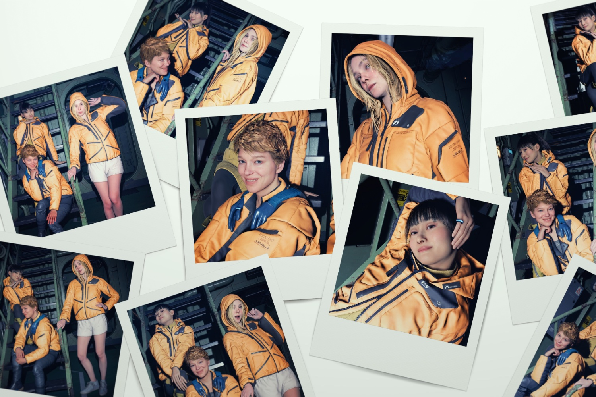

+++
title = "Pas de date pour Death Stranding 2, mais pas mal de trucs barrés"
date = 2024-09-29T17:47:32+01:00
draft = false
author = "Mickael"
tags = ["Actu"]
image = "https://nostick.fr/articles/vignettes/septembre/death-stranding-2.jpg"
+++

Cette présentation aurait presque pu être un email. L'événement spécial PlayStation du Tokyo Game Show consacré à *Death Stranding 2: On The Beach* a accouché d'une souris : Hideo Kojima et son équipe n'ont en effet pas pu révéler la date de sortie du jeu. « *Nous parlons de 2025, [le jeu] sortira l'année prochaine, donc nous l'annoncerons à un moment donné l'année prochaine. Cependant, en raison de circonstances imprévues, nous ne pouvons pas l'annoncer aujourd'hui* », a expliqué le créateur.



De quelles « *circonstances imprévues* » parle-t-on ? Mystère. La présentation a tout de même été l'occasion de dévoiler quelques unes des bizarreries du titre, à commencer par un mode photo dans lequel les trois héroïnes, Fragile (interprétée par Lea Seydoux), Tomorrow (Elle Fanning) et Rainy (Shioli Kutsuna) prennent la pose façon glamour.



Les photos qui s'afficheront à la manière d'un Polaroïd auront une influence sur le cours du jeu : « *Mieux vaudra prendre de bonnes photos* », prévient Kojima ! Autre fanfreluche, il sera possible d'admirer une prestation dansée de la marionnette Dollman avec le chanteur Daichi Miura, pour le morceau « Horizon Dreamer ».



OK donc. On a aussi appris qu'Hideo Kojima avait signé avec l'agence WME, leader mondial de la gestion de talents, pour « *gérer ce [qu'il] fait* » et « *s'occuper des échanges avec tous les acteurs* » avec lesquels il souhaite travailler. Et cela ne concerne d'ailleurs pas que les acteurs : les réalisateurs George Miller et Fatih Akin font plus que des caméos dans *Death Stranding*.

Dans *[Variety](https://variety.com/2024/gaming/news/hideo-kojima-death-stranding-movie-hollywood-wme-1236157008/)*, il a aussi expliqué que son studio ne devait pas se limiter à des jeux vidéo : « *J'ai créé Kojima Productions dans le cadre du "divertissement numérique"* », et cela peut impliquer certes un jeu vidéo, mais aussi un anime, un film, « *ou quelque chose de totalement différent* ». Mais le monde sera-t-il prêt ?