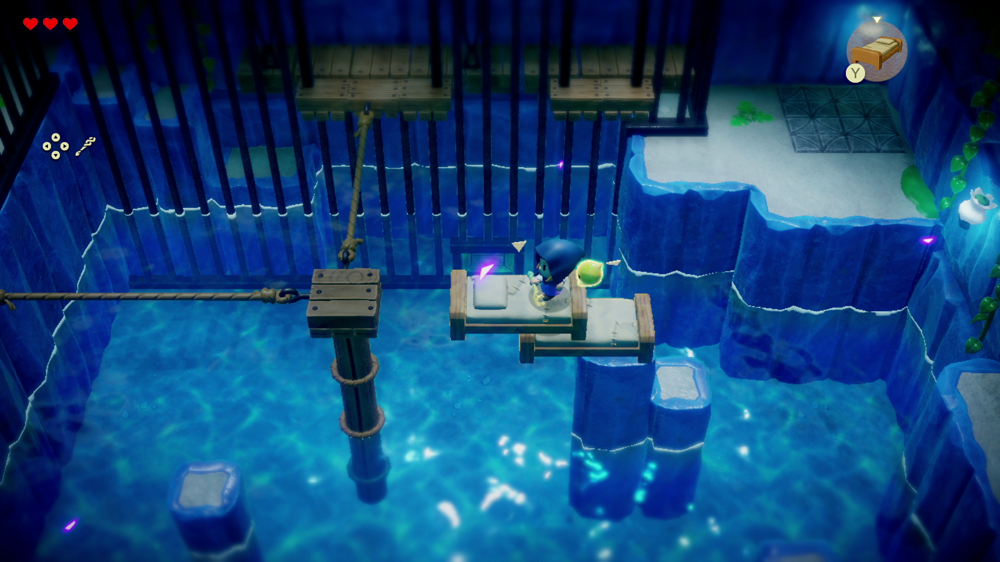

+++
title = "Zelda Echoes of Wisdom, Epic Mickey Rebrushed : le récap des sorties de la semaine (29/09)"
date = 2024-09-29T07:00:02+01:00
draft = false
author = "Félix"
tags = ["C’est dispo"]
image = "https://nostick.fr/articles/2024/septembre/2909-les-sorties-de-la-semaine/zelda.jpeg "
+++

Entre la garderie, les courses et la facture de régulation d’EDF qui tombe pile-poil alors que vous venez de commander votre PS5 Pro, vous n’avez peut-être pas eu le temps de vous intéresser aux nouveautés du moment. Qu’à cela ne tienne : voici les sorties de ces derniers jours qui ont retenu notre attention.

## Princesse des cœurs

Grosse semaine pour Nintendo, qui a sorti son premier Zelda dans lequel on incarne la princesse éponyme. Baptisé ***Echoes of Wisdom***, le jeu réutilise le moteur 2D mignon vu dans *Link’s Awakening* et nous invite à explorer un royaume d’Hyrule dans lequel tout le monde a été emprisonné dans des failles géantes avant d’être remplacé par des doubles maléfiques. Si Zelda ne peut pas se battre directement, elle peut invoquer des pouvoirs magiques pour distraire les monstres ou bien construire des escaliers à l’aide de multiples objets (le jeu avait commencé [comme un « Zelda Maker »](https://nostick.fr/articles/2024/septembre/2409-echoes-of-wisdom-commence-par-zelda-maker/)). On retrouve l’aspect créatif de *Breath of the Wild* dans une aventure visiblement bien plus condensée : certains testeurs ont apprécié le voyage là où une bonne partie reste sur sa faim, décrivant un hybride sympa mais qui s’essouffle à mi-parcours avec des performances [pas terribles](https://www.nintendolife.com/news/2024/09/zelda-echoes-of-wisdoms-frame-rate-is-even-worse-than-links-awakening) (moins bonnes que *Link’s Awakening* !). Ça reste une bonne pioche et le concept a le mérite de renouveler la licence, mais pas la peine de se ruer dessus si vous avez un backlog long comme le bras. 60 balles sur [Switch](https://www.nintendo.com/fr-fr/Jeux/Jeux-Nintendo-Switch/The-Legend-of-Zelda-Echoes-of-Wisdom-2590490.html).

## Un coup de peinture et c’est comme neuf

Il fallait bien qu’on se tape un remaster cette semaine, et c’est ***Disney Epic Mickey*** qui nous revient dans une version *‌Rebrushed*. Ce plateformer de 2010 développé par le studio de Warren Spector (*System Shock, Deus Ex*…) nous invite à explorer un monde mettant à l’honneur des personnages oubliés de Disney. On y retrouvera par exemple Oswald le lapin chanceux (l’un des premiers personnages créés par Walt Disney) dans une aventure faisant parcourir différents niveaux inspirés des parcs Disneyland en version plus d4rk. Le gameplay implique de faire des sauts de cabri et de mettre des claques, mais aussi d’utiliser un pinceau magique pour modifier le niveau : créer un pont, révéler un escalier… Le remaster a l’air de faire le taf et est surtout un prétexte pour apporter ce vieux jeu sur d’autres plateformes que la Wii en adaptant le gameplay d’époque qui reposait pas mal sur la Wiimote. Le jeu de base n’était pas un sans faute, mais ça reste à tester pour ceux qui cherchent un jeu de plateforme original et qui n’ont pas de PS5 pour jouer à *Astro Bot*. Dispo sur [Steam](https://store.steampowered.com/app/1522160/Disney_Epic_Mickey_Rebrushed/) et toutes les consoles, même PS4/Xbox One et Switch pour 60 €. Notons qu’une démo est proposée histoire d’essayer avant de raquer.

 

## Ohé, ohé, capitaine abandonné

Les jeux d’horreur à gros polygones sont à la mode en ce moment. On a récemment vu passer *[Crow Country](https://store.steampowered.com/app/1996010/Crow_Country/)*, *[Conscript](https://nostickreloaded.substack.com/i/147044574/la-guerre-la-guerre-ne-change-jamais)*, la démo de *[Fear the Spotlight](https://store.steampowered.com/app/1959390/Fear_the_Spotlight/)*… et aujourd’hui ***Mouthwashing***, un jeu d'horreur en vue FPS qui raconte l'histoire de l’équipage d’un cargo spatial à la dérive. Le capitaine a pété un plomb avant de planter le vaisseau dans un astéroïde, et il va donc s’agir de rester occupé en attendant la mort. Cela passe par des petites missions, rationner la nourriture et surtout papoter avec le reste de l’équipage pour comprendre ce qui a bien pu se passer. L’histoire dure moins de trois heures et est apparemment excellente : les quelques tests que j’ai lu sont très enthousiastes et décrivent une expérience mémorable. Ça a l’air barré, très cinématographique et parfait pour se faire peur pendant une soirée. Il y a une démo et ça ne coûte que 12,79 € [sur PC](https://store.steampowered.com/app/2475490/Mouthwashing/), ça mérite sans doute un coup d’œil.

 dans la tombe et regardait Caïn.")

## Rien Araconter ?

Microsoft aimerait bien avoir son *Civilization* maison et tente sa chance avec ***‌Ara : History Untold***, un 4X édité par 
Xbox Game Studios. Comme d’hab dans ce genre de jeu on commence au néolithique pour évoluer jusqu’à une époque futuriste en rencontrant au passage de grands noms comme George Washington ou César. Le jeu est apparemment très joli, fourmillant de petites animations donnant vie aux territoires et aux villes. Ce 4X apporte quelques mécaniques originales et de bonnes idées, mais ne convainc pas entièrement : si le système économique du jeu est décrit comme intéressant, la partie diplomatique n’est visiblement pas très poussée et le jeu manque d’options de personnalisation. Les combats semblent corrects, mais sans plus. Bref, un bon 7/10 qui a de la marge pour s’améliorer via des mises à jour et autres extensions. *‌Ara : History Untold* est uniquement disponible sur PC [pour 60 €](https://store.steampowered.com/app/2021880/Ara_History_Untold/), également inclus dans le PC Game Pass.



## En rab’

Vous aimez *Les Sims* ? Vous aimez *S.T.A.L.K.E.R* ? Alors vous adorerez ***City 20***, un jeu de gestion de villes post-apo fraîchement débarqué en early-access. Ça a l’air un peu brut de décoffrage, mais ça mérite sans doute une wishlist pour garder l’œil dessus (19,50 € sur [Steam](https://store.steampowered.com/app/1597980/City_20/)). Les fans de ballon rond seront ravis d’apprendre la sortie de ***EA Sports FC 25***, le même jeu que l’année dernière avec deux trois bricoles en plus facturé [70 balles](https://www.ea.com/fr/games/ea-sports-fc/fc-25/buy), parce qu’après tout pourquoi se priver. On notera aussi l’arrivée de ***Duckside***, qui se présente comme une sorte de *DayZ* ou de *Rust* avec des canards qui a pas l’air trop mal, du moins [pour 10 €](https://store.steampowered.com/app/2682580/DUCKSIDE/) en early-access. Enfin, les fans de vroum vroum arcade pourront jeter un œil à ***#DRIVE Rally***, dont l’early-access a été bien accueillie par les joueurs ([17 €](https://store.steampowered.com/app/2494780/DRIVE_Rally/)). 