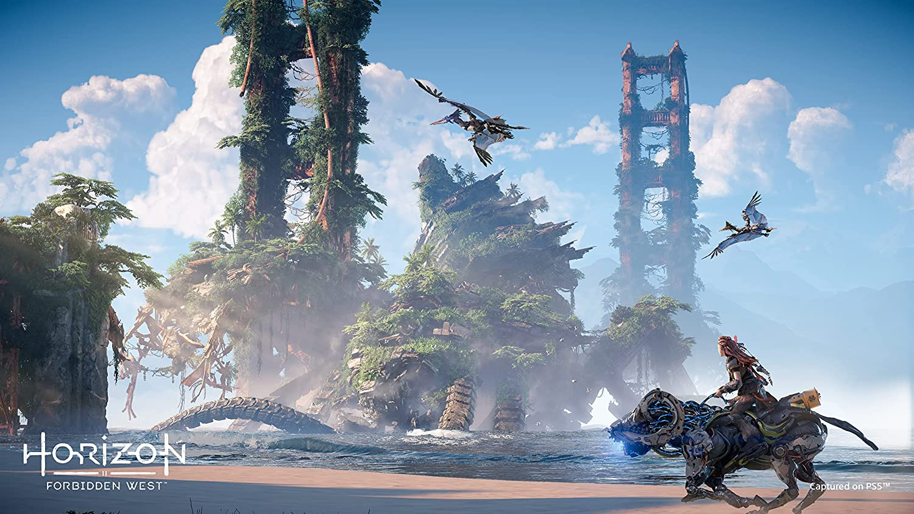

+++
title = "Horizon Online, le gros pari de Sony après le flop de Concord"
date = 2024-09-30T17:00:32+01:00
draft = false
author = "Mickael"
tags = ["Actu"]
type = "telex"
+++

Après avoir annulé le multi de *The Last of Us* et fermé *Concord* au bout de deux semaines, Sony mise probablement un peu moins sur les jeux services malgré le succès surprise de *Helldivers II*. Et pourtant, il va falloir aller au charbon pour promouvoir les prochains titres et ça ne sera pas facile : PlayStation n'a pas vraiment su exciter l'imaginaire avec *Marathon* et *Fairgame$*…

Un autre jeu pourrait avoir un peu plus de chance : *Horizon Online*. [Annoncé](https://x.com/LifeAtGuerrilla/status/1603752192166469634) en décembre 2022 par Guerrilla, il s'agira évidemment d'un jeu multi dans l'univers d'Aloy, mais a priori sans l'héroïne de *Horizon Zero Dawn* et de *Horizon Forbidden West*. Le studio a fait miroiter de nouveaux personnages « *et un style visuel unique* ».

*Horizon Online* est depuis resté sous le radar, du moins jusqu'à ce que Jason Schreier de *Bloomberg* donne quelques nouvelles au micro du podcast [Spawn Wave](https://youtu.be/R0A0ZEJ8dYE?t=3400). Il confirme que le jeu est le « *prochain produit* » de Guerrilla et que son développement occupait beaucoup de monde. Pas de troisième volet pour Aloy à l'horizon (tu l'as ?) donc, du moins pas pour le moment. Le studio avait néanmoins assuré qu'il allait continuer à faire des aventures solo.