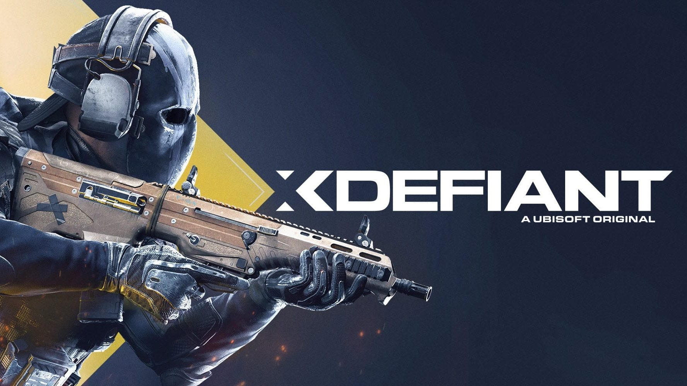

+++
title = "Ubisoft confirme que ce n’est pas la grande forme pour XDefiant"
date = 2024-09-30T19:00:00+01:00
draft = false
author = "Félix"
tags = ["Actu"]
image = "https://nostick.fr/articles/2024/septembre/3009-pas-la-grande-forme-xdefiant/xdefiant.jpg"
+++

 

Ce n’est décidément pas la joie chez Ubisoft. Alors que la boîte à Guillemot a [annoncé](https://nostickreloaded.substack.com/i/149499247/la-grosse-info-de-la-semaine-comment-ca-va-mal-ubisoft) en catastrophe le report d’*Assassin’s Creed Shadows* et des ventes pas terrible pour *Star Wars Outlaws*, on apprend aujourd’hui que le free-to-play *[XDefiant](https://www.ubisoft.com/fr-fr/game/xdefiant)* a du mal à trouver son public. « *XDefiant est actuellement en deçà de nos prévisions* », a déclaré le PDG d’Ubisoft à l’occasion d’une conférence avec les investisseurs.

Ce FPS voulant tenir tête à *Call of Duty* a connu un démarrage encourageant, celui-ci ayant atteint le million de joueurs uniques deux heures et demie après son lancement à la fin mai. Malgré ces 11 millions de joueurs en juin, les chiffres se sont visiblement essoufflés tant et si bien qu’Ubisoft a dû [calmer les rumeurs](https://nostick.fr/articles/2024/septembre/1809-xdefiant-pas-mort/) annonçant la mort du jeu à la rentrée. Selon *[Insider Gaming](https://insider-gaming.com/xdefiant-fallen-behind-expectations/)*, *XDefiant* comptait moins de 200 000 joueurs actifs par jour au mois d’août. Un chiffre honorable (vous vous souvenez des [700 joueurs PC](https://nostick.fr/articles/2024/aout/2408-concord-se-crashe-au-decollage/) de *Concord* ?) mais qui n’est apparemment pas suffisant pour Ubisoft.

Yves Guillemot a promis plus de détails dans un futur rapport qui sera publié au mois d’octobre. Tout n’est pas perdu pour *XDefiant*, le jeu ayant connu un regain d’intérêt de 40 % après l’arrivée de nouvelles récompenses quotidiennes. Il n’est pas disponible sur Steam alors qu’Ubisoft va bientôt y apporter *Star Wars Outlaws* : un lancement sur la plateforme de Gaben semble probable et pourrait l’aider à trouver un second souffle. 