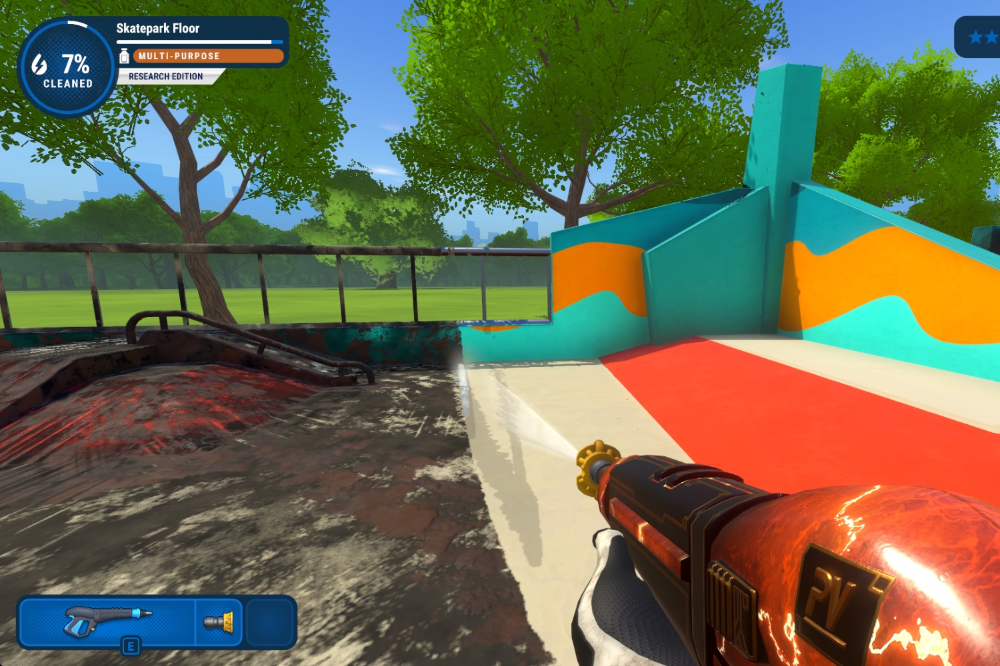

+++
title = "PowerWash Simulator : nettoyer fait du bien à l'humeur, et c'est la science qui le dit"
date = 2024-09-30T08:01:32+01:00
draft = false
author = "Mickael"
tags = ["Actu"]
image = "https://nostick.fr/articles/vignettes/septembre/powerwash-simulator.jpg"
+++

Laver des trucs, ça fait un bien fou. Tous ceux qui se sont frottés à *PowerWash Simulator* le savent bien : nettoyer la saleté libère de l'endorphine ! Et ce n'est pas moi qui le dis, mais la science : une [étude](https://steamcommunity.com/app/1290000#scrollTop=0) menée par l'Oxford Internet Institute, un groupe de l'université d'Oxford, a pu le constater. 72,1 % des joueurs ont obtenu une amélioration de leur humeur !

 

L'étude a été menée auprès de 8 700 joueurs partout dans le monde, qui ont pratiqué une version spéciale de *PowerWash Simulator* développée par FuturLab, le créateur du jeu. Cette version spéciale « recherche » ressemble beaucoup au titre original bien sûr, mais elle enregistre plusieurs métriques en cours de partie et un personnage demande aux joueurs de répondre à un questionnaire.

Les chercheurs ont obtenu plus de 162 000 rapports des joueurs tout au long de leurs 67 000 sessions individuelles. Une des originalités de cette étude, c'est qu'en dehors de la version spéciale du jeu, l'idée était de laisser les joueurs jouer à *PowerWash Simulator* chez eux, dans leur environnement de tous les jours, et non pas dans un laboratoire, ce qui peut avoir un effet négatif sur les résultats.

Si la grande majorité d'entre eux ont bénéficié d'un boost de leur humeur, celle-ci se produit dans les 15 premières minutes de jeu. Ensuite, l'humeur se stabilise et ne revient pas aux niveaux d'avant le jeu avant plusieurs heures. Autrement dit, on se sent bien pendant un bon moment après avoir joué.

Tout cela est bel et bon, toutefois il faut relever que les résultats ne prouvent pas de lien de cause à effet direct entre le jeu et l'amélioration de l'humeur : les raisons pour lesquelles les joueurs commencent une session peuvent aussi avoir une influence sur l'humeur initiale. L'étude suggère néanmoins que les jeux peuvent avoir un effet bénéfique sur l'humeur.