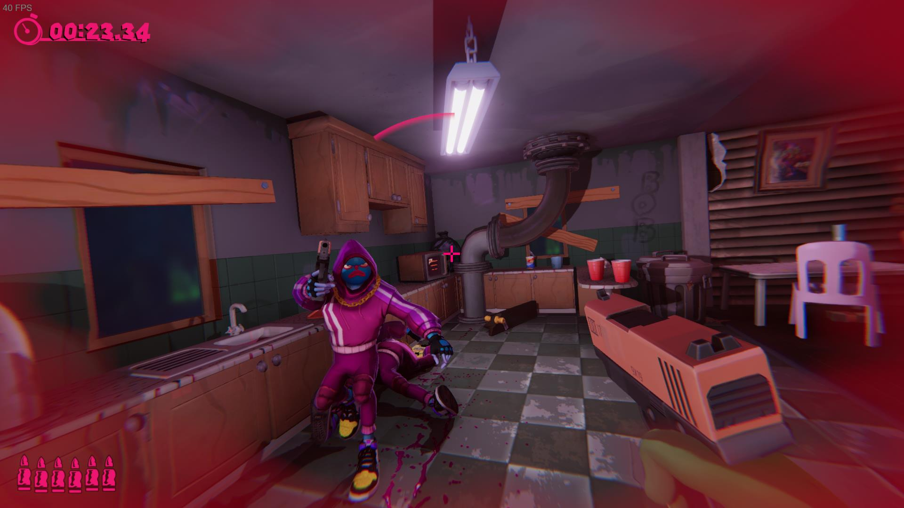
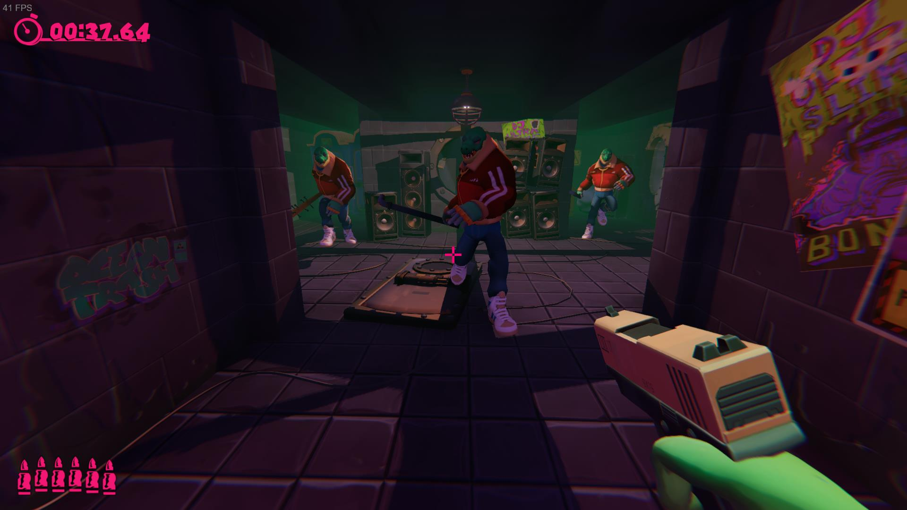
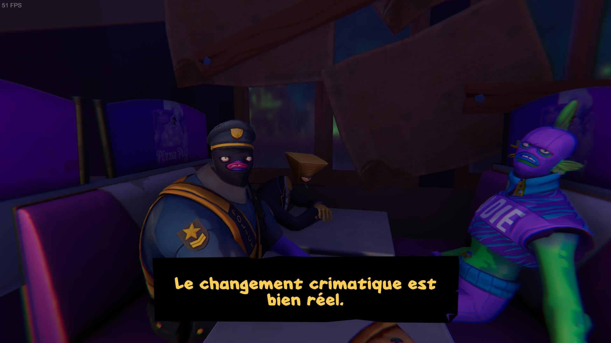
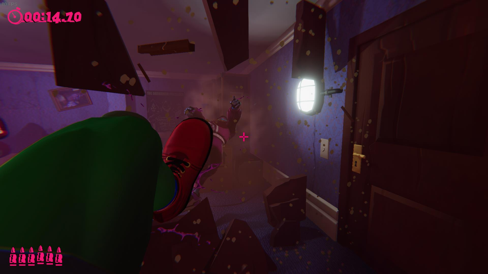
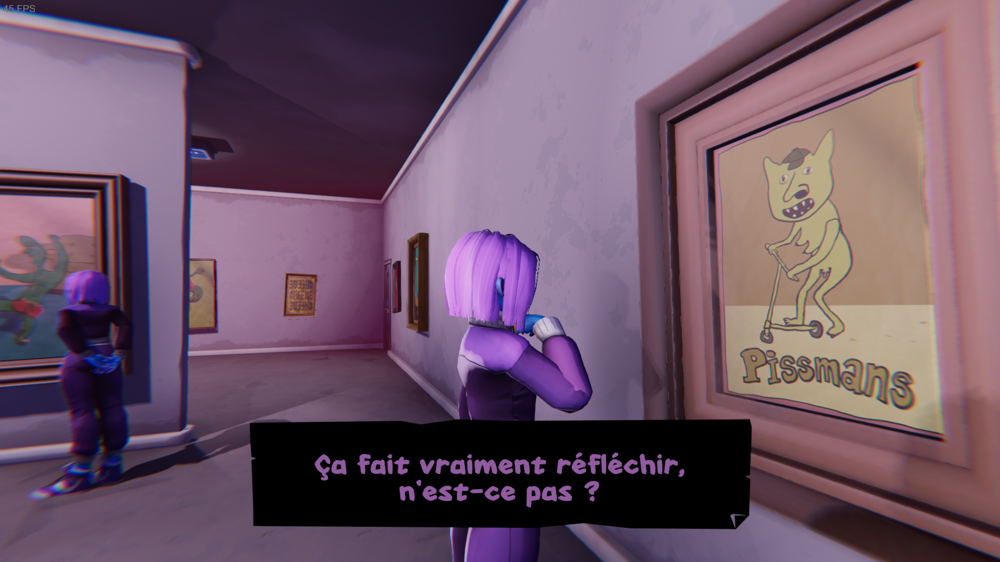

+++
title = "Test de Anger Foot : Devolver met les pieds dans le plat"
date = 2024-09-30T16:30:00+01:00
draft = false
author = "Félix"
tags = ["Test"]
type = "une"
image = "https://nostick.fr/articles/2024/septembre/3009-test-anger-foot-devolver-pieds-dans-le-plat/screen01.jpg"
+++ 

J’ai passé un paquet de temps sur *Hotline Miami*, et il faut bien admettre que je suis friand de sa formule à base de niveaux bourrins très rapides à terminer me permettant d’avancer à petite dose lors des journées chargées. J’ai récemment [testé](https://nostick.fr/articles/2024/juin/2504-test-de-katana-zero/) *Katana Zero*, qui m’a fait retrouver cette sensation de transe dans laquelle on optimise chaque coup sur une musique survoltée. Après la vue du dessus et la 2D, [*Anger Foot*](https://store.steampowered.com/app/1978590/Anger_Foot/) arrive avec une proposition intéressante, mais pas surprenante : et si on transposait ce concept en vue FPS ?

## Et tu tapes, tapes, tapes, c'est ta façon d'aimer

L’histoire d’*Anger Foot* tient sur un post-it : vous êtes un fan de sneakers qui se fait voler ses 4 plus belles paires par autant de gangs différents, qu’il va donc falloir aller chercher à grand coup de pied dans la tronche. L’arme principale de notre personnage est en effet son panard, surpuissant et tuant la plupart des adversaires en un coup.

Le jeu baigne dans une ambiance crado-punk et brille par son absence de finesse : la ville que l’on explore s’appelle *Shit City* et est remplie d’immeubles répugnants bardés de tags, de squat aux toilettes bouchées et autres égouts. Les différents ennemis sont des malfrats en jogging colorés qui se comptent par dizaines, cherchant à vous faire la peau au corps à corps comme à coup de fusil.

Le crime est encouragé à *Shit City*, et chaque gang cherche à être le plus mauvais possible à sa manière : le gang de la pollution déverse des bidons verdâtres dans l’eau là où le gang des affaires préfère le crime en col blanc. L’atmosphère d’*Anger Foot* se fait surtout remarquer lors de ses niveaux intermédiaires, sans baston et pendant laquelle on explore brièvement de petites cartes remplies de PNJ avec qui papoter.

La plupart des blagues sont bien trouvées et participent à créer une ambiance sympathique. Le cocktail vire parfois au pipi-caca avec un grand nombre de toilettes et autres clins d’œil crados qui pourront en rebuter certains. Que les plus allergiques se rassurent : cette toile de fond se fait rapidement oublier dès qu’un niveau commence. La partie scénario est optionnelle et vous pouvez très bien vous contenter de tout passer en ligne droite sans parler à personne pour enchaîner les niveaux.

## Des pieds et des mains

Le concept du jeu est plutôt simple : il y a 4 mondes composés d’une quinzaine de niveaux chacun, terminables entre 1 et 3 minutes selon vos *skillz*. Le personnage commence généralement nu pied et peut donner un coup de pied à courte portée face à lui, façon *Duke Nukem*. C’est une arme extrêmement efficace, autant pour enfoncer les portes de manière jouissive que pour savater d’un coup une bande de vilains. Les appartements, couloirs d’égouts et autres bureaux parcourus sont également parsemés de flingues, allant du basique pistolet à la grosse mitraillette. Attention, car votre héros n'est pas bien résistant et meurt d'une simple attaque au corps à corps.

L’objectif consiste à atteindre la fin du niveau en vie, mais quelques challenges proposés avant le top départ permettent de relever un peu la formule. On pourra être incité à speedrunner une carte, ne pas utiliser d’arme ou encore à porter certaines chaussures particulières. Les différentes godasses débloquées au fil des niveaux servent à gagner différents atouts pendant une partie, par exemple pour sauter plus haut, aller plus vite, faire un dash… C’est bien foutu : l’expérience peut parfois changer radicalement selon les pompes portées ou les challenges envisagés.

Mis à part entre les 4 mondes, les niveaux ne sont pas particulièrement variés et se démarquent surtout par leur level design. Comme dans un *Hotline Miami*, on déboite une porte d’un coup de pied avant de frapper le garde à droite, de tirer sur celui de gauche et de jeter son arme pour assommer le troisième qui se tenait plus loin. La frénésie fonctionne globalement bien, encore plus si vous essayez de réussir les défis qui impliquent généralement d’optimiser ses actions. Certaines cartes sont moins bonnes que d’autres, mais la courte durée de vie des niveaux et la présence de certaines chaussures puissantes font qu’on reste rarement bloqués trop longtemps. Notons que des boss viennent conclure chaque monde pour des combats en trois parties sympathiques.

Là où *Hotline Miami* avait opté pour une BO synthwave électro bien intense, *Anger Foot* tape plutôt dans la hardtek. Les fans de grosses basses et de boum boum apprécieront, et si je suis généralement allergique à ce genre de musique, c’est ici bien trouvé : cela participe autant à l’atmosphère du titre qu’à plonger le joueur dans l’action.

## On prend son pied ?

*Anger Foot* est bourrin, nerveux et réussit une bonne partie de ce qu’il entreprend. La difficulté est bien dosée, le jeu étant plutôt corsé de base et se montrant assez dur pour certains objectifs optionnels. Au niveau du gameplay, on regrettera des armes pas forcément très jouissives à utiliser, ce qui s’explique peut-être par le fait que j’ai principalement joué au pad.

L’univers est sympa et les petites coupures scénario ont l’avantage d’être brèves et rigolotes. Les décors ne se renouvèlent pas vraiment, mais ce n’est pas forcément primordial dans un jeu surtout axé sur le gameplay. J’aurais apprécié un peu de changement sur la fin, le dernier monde m’ayant quelque peu lassé. Les différents objectifs pour chaque map restent une bonne idée pour inciter à reprendre la manette.

Bref, *Anger Foot* est un jeu d'action bien énervé qui devrait vous occuper une dizaine d'heures. À essayer si vous êtes curieux de voir ce que donnerait un *Hotline Miami* en 3D et que vous accrochez à l'ambiance qui se dégage des trailers.

 

*Jeu testé sur ROG Ally X. 25 € sur [Steam](https://store.steampowered.com/app/1978590/Anger_Foot/), uniquement disponible sur PC*